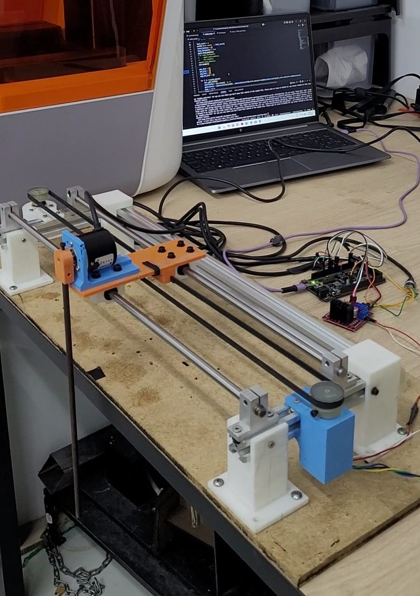

# Inverted Pendulum Project

This repository implements a Soft Actor-Critic (SAC) agent with adaptive entropy for swing-up control of an inverted-pendulum system. The project contains both the software used for training/evaluation and visualization, and the Arduino firmware and hardware details for a physical pendulum setup.

This repository was developed as a fork of an existing public implementation. The project code is hosted on GitHub. The hardware uses an Arduino Mega board for sensor and actuator interfacing.

## Table of Contents
1. [Software Setup](#software-setup)
2. [LQR](#LQR)
3. [Usage](#usage)
4. [Hardware](#hardware)
5. [File Descriptions](#file-descriptions)
6. [Manual Mode](#manual-mode)
7. [Graphics](#Graphics)
8. [Troubleshooting](#troubleshooting)


## Software Setup
### Prerequisites
Create and activate a Python environment, then install required packages from `requirements.txt`.

### Installation
1. Clone this repository:
   ```
   git clone https://github.com/JuanCBrito/Inverted-Pendulum-with-Reinforcement-Learning.git
   cd Inverted-Pendulum-Reinforcement-Learning
   ```

2. Install the required Python packages:
   ```
   pip install -r requirements.txt
   ```

3. Configure the serial port: open `environment.py` and update the `arduino_port` variable inside the `InvertedPendulumEnv`class to match your system.

4. Upload the Arduino firmware:
   - Open `inverted_pendulum_arduino.ino` in the Arduino IDE.
   - Select Arduino Mega board and the correct port
   - Upload to the board.

## LQR
The repository includes an LQR controller/collector. To use it:
1. Upload the Arduino sketch `LQRwithFLswingup.ino` to the Arduino Mega.
2. Use the `Datos_LQR/lectura_serial.py` script to read and save serial data generated by the controller.

Parameters to tune inside the Arduino/LQR code:

Dentro de este código se requieren modificar los siguientes parámetros:

-  `Mt`: Masa del carro
-  `Cfriction`: Coeficiente de fricción coulombiana.
-  `Bfriction`: Coeficiente de fricción viscosa;
-  `Jp`: Momento de inercia del péndulo respecto a su centro de masa
-  `mp`: Masa del péndulo (kg)
-  `lp`: Distancia desde el pivote hasta el centro de masa del péndulo (m)
-  `g`: Aceleración de la gravedad
-  `armatureResistance`: Resistencia de armadura del motor;
-  `pulleyradius`: Radio de la polea (m);
-  `kt`: Constante de torque del motor

The parameter values used for our pendulum were identified experimentally through direct measurements, including oscilloscope analysis, voltage peak characterization, and additional system response tests. Since mechanical tolerances, friction, motor characteristics, and assembly conditions vary between setups, these parameters are system-specific. Therefore, each implementation should perform its own experimental identification and calibration procedures to obtain accurate model values.

## Usage
1. Manual control (GUI)

1. To run the manual control mode:
   ```
   python environment.py
   ```
-   Opens a PyGame visualization and serial connection to the Arduino.

-   Click the input box at the top to enter a control value, then press Enter to send it.

-   Press Space to toggle between Position and Voltage control modes.

-   Use Shift (or the GUI toggle) to switch control modalities if implemented.

-   The top-right corner shows the current mode; the bottom area displays live telemetry (position, angle, speed).

**Important**: Ensure the pendulum is hanging straight downward when you plug in the Arduino and before starting programs.

2. To train the SAC agent:
   ```
   python main_sac.py
   ```
- Starts a new training session.

- Make sure the `chkpt_dir` setting does not overwrite previous checkpoints unless intended.

- Keep a stable power supply during training — large voltage drops lead to poor learning.

If you want to modify entropy behavior in training, you can change `agent.entropy` or related hyperparameters in `main_sac.py` / `agent_sac.py`.

3. To run the trained agent:
   ```
   python test_sac.py
   ```
   Loads a pre-trained model and runs it on the real system.

## Hardware

Physical components used for the setup:

1. Arduino Mega
2. DC motor (500 RPM, 12 V)
3. Motor driver (monster motor shield)
4. Two rotary encoders 2400 PPR:
   - Rail encoder (cart position)
   - Pendulum encoder (pendulum angle)
5. 3D-printed mechanical parts for pendulum and cart
6. Metal pulleys (3D-printed pulleys wear out during training)
6. Linear rail system
7. 12 V contant power supply(SMPS)

### Hardware evidence


### Hardware Details and Notes

- **Arduino Mega vs Arduino Uno**: Uno can be used but using the Mega reduces missed encoder steps because it provides more interrupt pins and resources.

- **Encoder resolution**: The pendulum encoder used in this project is 1200 PPR → 1440 CPR after quadrature decoding, yielding ~0.25° resolution.

- **Mechanical wear**: Metal pulleys and robust printed parts are recommended; 3D printed pulleys can wear quickly with repeated training.

Verify that the GUI coordinate system and physical wiring correspond (encoder zero positions, sign conventions).

## File Descriptions

- `environment.py`: Defines the `InvertedPendulumEnv` class, which handles the pygame visualization and communication with the Arduino.
- `agent_sac.py`: Implements the Soft Actor-Critic agent.
- `networks.py`: Contains the neural network architectures for the actor, critic, and value networks.
- `buffer.py`: Implements the replay buffer for storing experiences.
- `main_sac.py`: Script for running the training of the SAC agent. Puedes modificar la reducción de entropia con `agent.entropy`.
- `test_sac.py`: Script for running the evaluation of the SAC agent.
- `plotting.py`: Plotting utilities used by `test_sac.py`.
- `inverted_pendulum_arduino.ino`: Arduino code for controlling the hardware and communicating with the Python environment. This code is specifically designed for the Arduino Mega and handles reading from two rotary encoders using interrupt pins.
- `Datos_LQR/lectura_serial.py`: LQR seria lreader and logger.
- `Graphics/`: Contains plotting scripts and example graphs.

## Manual Mode
Manual mode is useful for initial hardware verification and debugging:

1. Start `environment.py`.
2. The PyGame window shows a simple GUI with an input box and telemetry.
3. Enter control values and press Enter to send.
4. Use Space to toggle control mode (Position / Voltage).
5. Observe telemetry at the bottom (position, angle, velocity, angular velocity).

Manual mode helps you:
- Verify hardware wiring and encoder signals.
- Calibrate zero positions and sign conventions.
- Test motor response and PID/voltage ranges before running automated training.

## Graphics
- Store control-test results from `test_sac.py` in the Graphics/Graficas_control folder and use the plotting scripts to generate comparison plots across runs.

- For learning curves, save printed training statistics to a .txt file and use Gráficas_curvas_aprendizaje.py to generate the plots.

## Troubleshooting

### HARDWARE
- **No hardware response**: check power, motor driver wiring, and that the Arduino sketch is uploaded correctly. Verify the COM port and baud rate.

- **Manual mode not working**: confirm the correct arduino_port in environment.py. Open the Arduino Serial Monitor to check for errors.

- **Encoder issues**: verify encoder wiring to interrupt pins, check for loose connections, and confirm quadrature decoding in the Arduino code.

### TRAINING
- **Serial communication problems**: confirm correct COM port and that no other application is blocking the port. Reconnect the board if necessary.

- **Training does not converge**: try adjusting the agent hyperparameters (learning rates, network sizes, target entropy schedule). Ensure the environment observations are correct and the reward signal reflects the control objective.

- **No visible learning progress**: the base repo may not provide explicit episode/log outputs indicating learning. With the modifications in this fork you should be able to observe policy progress in the training logs and generated plots. Set a minimum target entropy (recommended 0.2) or tune adaptive entropy parameters to balance exploration.

